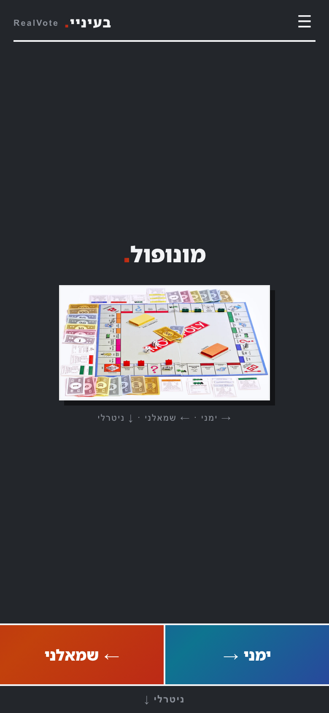
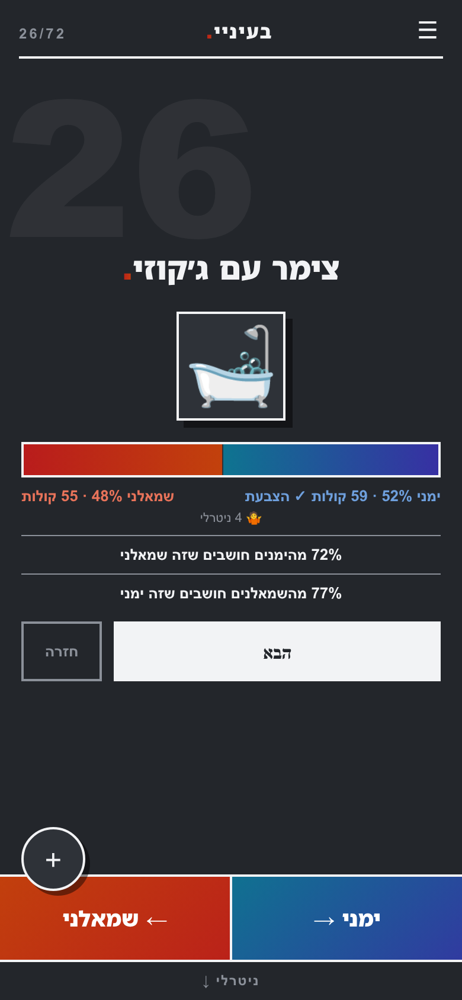
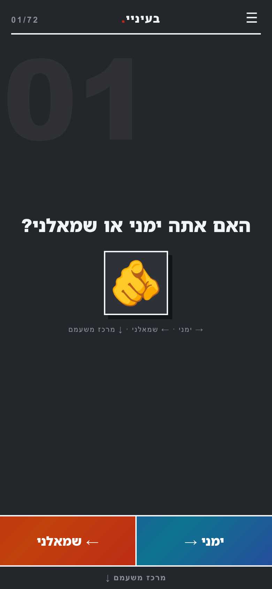
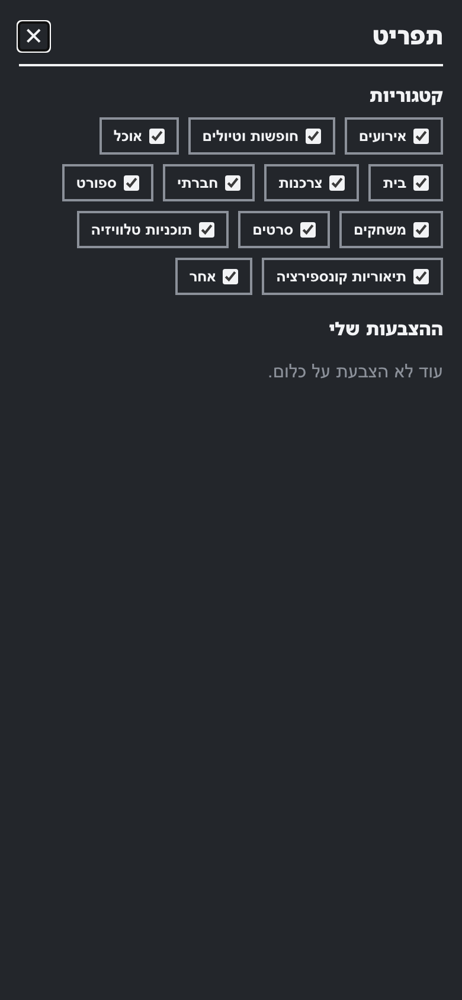
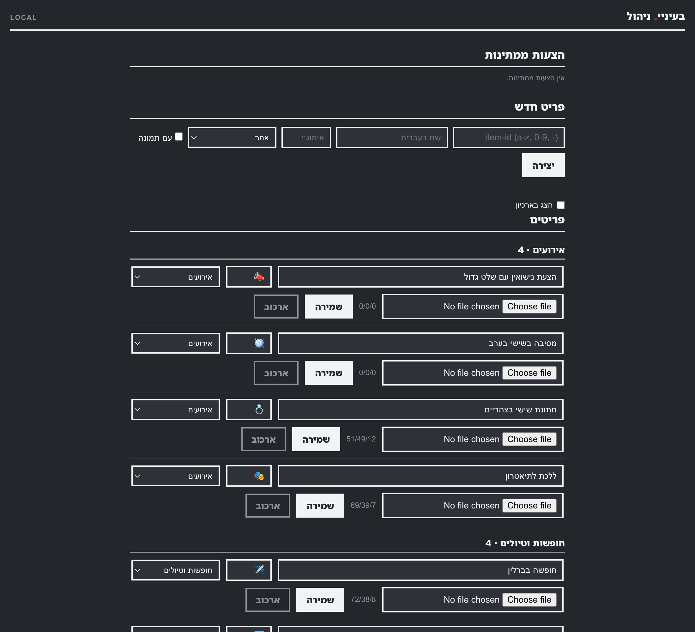
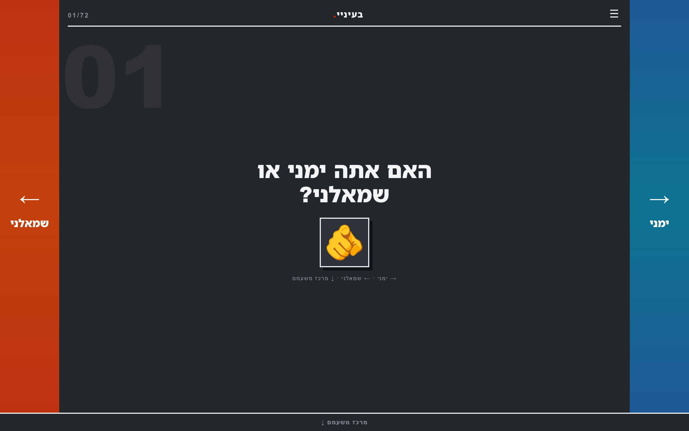

# RealVote · דברים שהם… בעיניי

A Hebrew, right-to-left voting site built around an Israeli social-media trend: people posting lists
of *"things that are left-wing in my eyes"* and *"things that are right-wing in my eyes"*. Here the
crowd decides instead of the poster — you swipe through Friday-noon weddings, Keter garden chairs
and fridge magnets, calling each one **ימני** or **שמאלני**, and the split appears the moment you
vote.

Serverless on AWS, cheap when idle and able to absorb a viral day. No accounts, no tracking, no
personal data — an anonymous cookie is the whole identity model.

> **Status:** feature-complete and running locally. The AWS deployment
> (`realvote.latnook.com`) is the remaining piece.

## What it looks like

| Voting | The reveal |
|---|---|
|  |  |

The reveal above is the site's whole reason for existing: **72% of self-identified right-wingers
call a jacuzzi cabin left-wing, while 77% of left-wingers call it right-wing.** Both camps disown
it onto the other. That line only appears when a camp has 25+ decisive votes on an item and crosses
70% — the site stays quiet unless it has something worth saying.

| Who are you? | Categories | Admin |
|---|---|---|
|  |  |  |

Somewhere between your 3rd and 10th vote the site asks **האם אתה ימני או שמאלני?** (third option:
מרכז משעמם). From then on every earlier vote is retroactively attributed to your camp, which is
what makes the cross-tabulation possible.

On desktop the screen edges become full-height vote zones that mirror the arrow keys:



## How it works

**Voting.** Three equivalent inputs — buttons, arrow keys (`→` ימני, `←` שמאלני, `↓` ניטרלי), or a
swipe anywhere on the card area. Stats animate in after you vote, never before, so the crowd can't
lead you. No timer: you advance when you're ready, and can step back through what you answered.

**One vote per item** is enforced by the database, not the browser: the vote insert is a conditional
write, and the counter increments in the same DynamoDB transaction — so a thousand simultaneous
voters can't lose or double-count anything.

**Suggestions.** After five votes a ➕ appears. Suggestions land in a moderation queue rather than
going live, because a public political site attracts exactly what you'd expect.

**Categories.** Every item has one of twelve categories, and visitors can switch categories off in
the ☰ menu; the deck follows. There is deliberately no progress counter — the deck grows, and a
finish line would only make it feel like homework.

## Design

"Swiss gradient slate" — International-Typographic layout (strict grid, 2px rules, sharp corners,
generous space) on dark graphite, with the two vote fields as slowly drifting gradients:
deep indigo→cyan for ימני, crimson→burnt-orange for שמאלני. One theme, no light/dark toggle. Every
value lives in [`site/css/theme.css`](site/css/theme.css).

The direction mapping is treated as sacred throughout: **ימני is always right, blue, `→`; שמאלני is
always left, red, `←`.** Buttons, keys, swipes and the results bar all agree.

## Architecture

```
Browser ──► CloudFront ──┬──► S3            static site (no build step, vanilla ES modules)
                         └──► API Gateway ──► Lambda (Python) ──► DynamoDB (single table)
                                                                  Cognito guards /api/admin/*
```

Everything is pay-per-request: idle cost is under $1/month, and a viral day costs a few dollars that
day. There is no server to keep running, patch, or resize.

- **`backend/`** — one Lambda handler with a small router, a single-table DynamoDB data layer, and a
  local server that synthesizes the same API Gateway events so local and production run identical
  code.
- **`site/`** — static HTML/CSS/JS. No framework, no bundler, no dependencies; the files you edit
  are the files the browser runs.
- **`scripts/`** — local dev, image ingestion, and a check for the cross-attribution rule.

## Run it locally

Needs Docker, Python 3.12+, and ImageMagick (for the image tooling only).

```bash
python3 -m venv .venv && .venv/bin/pip install -r backend/requirements-dev.txt
./scripts/local-dev.sh --votes 50        # DynamoDB Local + seed + http://localhost:8080
```

Site at <http://localhost:8080>, admin at <http://localhost:8080/admin/> (authentication is skipped
locally; in production API Gateway verifies a Cognito token before any admin request reaches the
code). Add `HOST=0.0.0.0` to reach it from a phone on the same network.

To see the cross-attribution lines, seed voters who have declared a side:

```bash
cd backend && TABLE_NAME=lr-local DDB_ENDPOINT=http://localhost:8000 ../.venv/bin/python seed_crosstab.py
```

## Tests

```bash
docker compose up -d dynamodb
cd backend && ../.venv/bin/pytest -q      # 76 tests against DynamoDB Local
node scripts/check-crosstab.mjs           # boundary checks for the cross-attribution rule
```

## Adding items and pictures

Items are seeded from [`backend/seed/items.json`](backend/seed/items.json) and managed from
`/admin/`, where each row can be renamed, re-filed, given a picture, archived and restored.

The pictures themselves are **not in this repository** — `images.csv` records where each one came
from, so a fresh clone can fetch them. Items without a picture fall back to a large emoji.

For bulk work: fill the `image_url` column of `images.csv` (a URL or a local path) and run

```bash
./scripts/add-image.py --from-csv images.csv     # --missing shows what still needs one
```

Remote images are **downloaded and stored**, never hotlinked — remote URLs expire and tracker
blockers drop requests to CDN hosts, so a hotlinked picture silently disappears for many visitors.
SVGs are kept as vectors and sanitised on the way in.

## Documentation

- [`docs/superpowers/specs/`](docs/superpowers/specs/) — the design documents, including why the
  cross-attribution rule has the thresholds it has
- [`docs/superpowers/plans/`](docs/superpowers/plans/) — the implementation plans, task by task

## Privacy

No accounts, no analytics, no third-party requests. A visitor is a random 32-character id in a
cookie. The one genuinely sensitive value — your political self-identification — is stored as one of
three words against that random id, with no name, email or IP beside it. The admin interface only
ever shows aggregates.

## Licence

MIT — see [`LICENSE`](LICENSE). Item pictures are **not** covered by it: each was collected from a
third-party source recorded in `images.csv`, and their licences vary.
